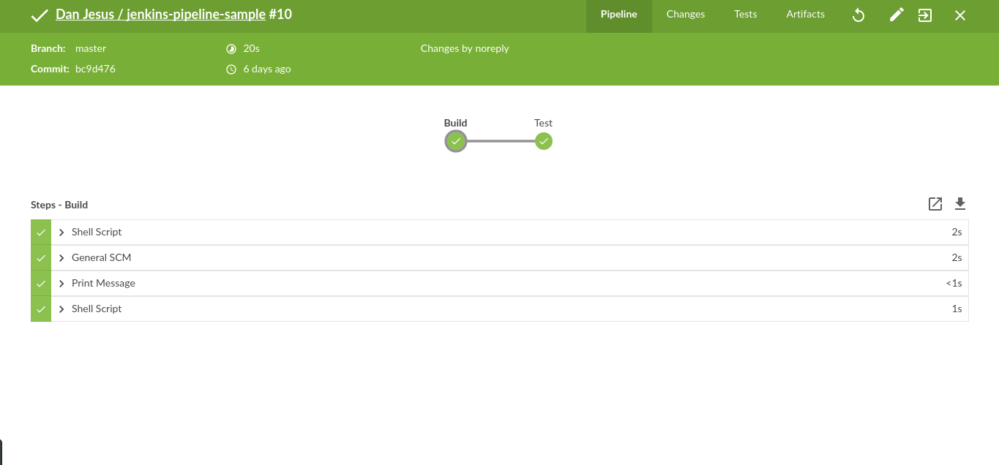
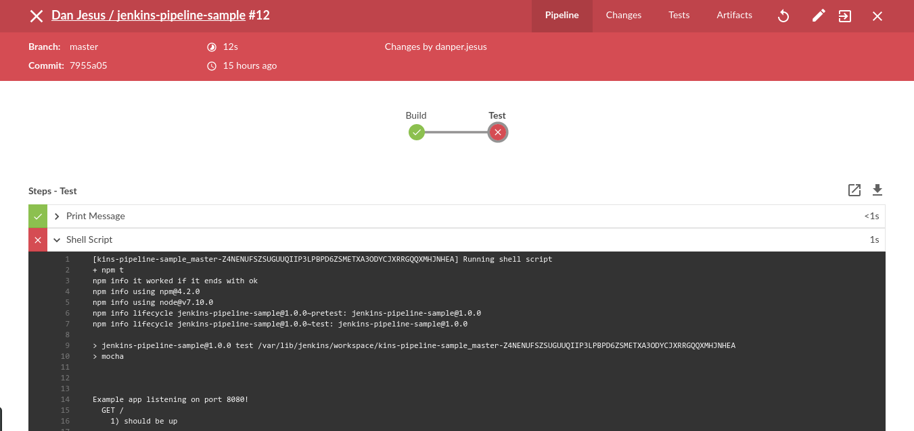

# jenkins-pipeline-sample
Jenkins blueocean sample pipeline config

This project is a case study to use jenkins blueocean with pipelines and docker

# How to use
- Install jenkins and jenkins blueocean
- Fork this repository
- Create a new pipeline inside blueocean
- Select github and put your github project fork url

# Docker experiment
All application run over docker with nginx as load balancer

## Prerequisites
- Install docker

## How to run app over docker
Create a docker image for application ```docker build -t jenkins-app .```

Run app container in two distinct ports

``` docker run -e "MESSAGE=first instance,PORT=8081" -p 8081:8080 -d jenkins-app ```

``` docker run -e "MESSAGE=second instance,PORT=8082" -p 8082:8080 -d jenkins-app ```

``` docker run -e "MESSAGE=third instance,PORT=8083" -p 8083:8080 -d jenkins-app ```

``` docker run -e "MESSAGE=fourth instance,PORT=8084" -p 8084:8080 -d jenkins-app ```

## Run nginx load balancer

Go to nginx-docker dir and build nginx container with ```cd nginx-docker && docker build -t load-balance-nginx .```

Run nginx container ```docker run -p 80:80 -d load-balance-nginx ```

## Test
To test go to browser and access http://localhost or make a curl request via terminal like this ```curl -i localhost```.

## Screenshots of jenkins pipeline

Build successfully


Build failing

